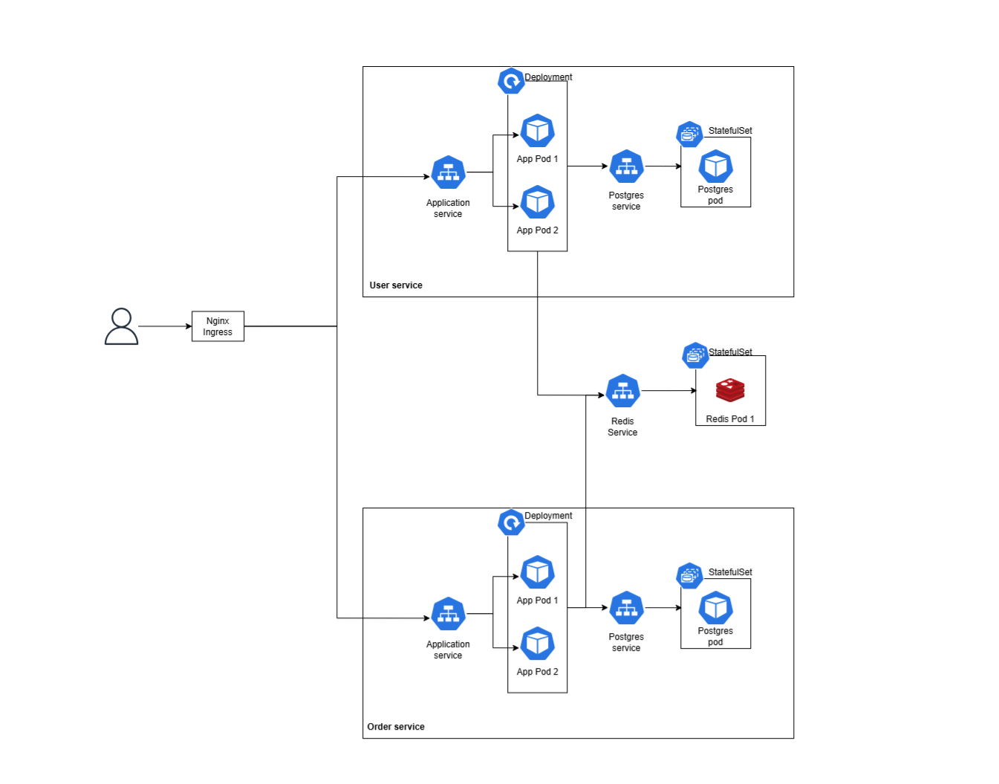

# Microservice Deployment on Kubernetes with Nginx Ingress

This repository has implementation of microservices deployed on Kubernetes. Microservices are built using Flask with Postgres database and Redis for caching.

## Roadmap
- [x] Create User and Order microservices using Flask
- [x] Dockerize the application and publish the images to DockerHub
- [x] Deploy single instance Postgres as StatefulSet as well as both the Flask apps
- [x] Redis StatefulSet for caching
- [x] Nginx Ingress to route incoming request to desired microservice
- [ ] Secrets for db credentials
- [ ] Observability using OpenTelemetry
- [ ] Monitoring using Prometheus, visualization using Grafana
- [ ] Cofiguration management using Kustomize
- [ ] Helm charts for package management
- [ ] Add liveliness/readiness probes
- [ ] JWT authentication (cross authentication in microservice architecture)
- [ ] Deploy on GKE (Google Kubernetes Engine)
- [ ] Terraform for infrastructure provisioning on Google Cloud
- [ ] Jenkins or Github Actions for CI/CD automation
- [ ] ArgoCD for GitOps
- [ ] HA Redis cluster using Sentinel
- [ ] HA Postgres cluster using Patroni
- [ ] Using Kubernetes Operator for Postgres database
- [ ] Postgres row lock when writing
- [ ] Istio service mesh
- [ ] Multi cloud deployment using Rancher
